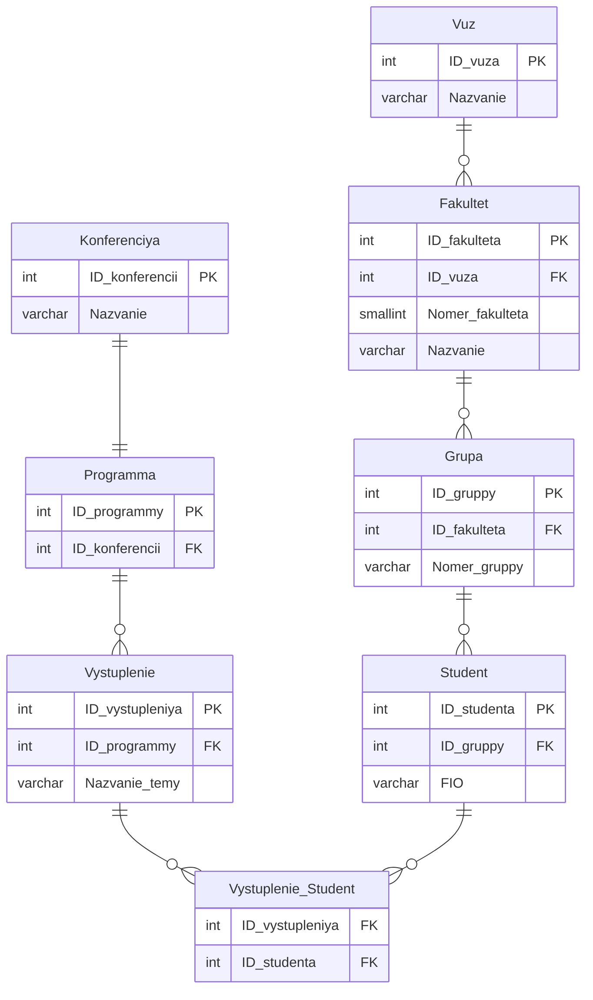

# Отчёт о лабораторной работе № 1

## 1. Цель работы

Сформировать навыки проектирования реляционной базы данных и создания её структуры в СУБД PostgreSQL с описанием ссылочной целостности и ограничений на допустимые значения полей в духе учебного пособия по дисциплине.

## 2. Задание

Вариант 5 приложения к пособию. Требуется спроектировать базу данных для хранения сведений о вузе, факультетах, учебных группах и студентах, а также о научных конференциях, программах конференций, отдельных выступлениях с указанием темы доклада и участии студентов в выступлениях. Построенная структура должна поддерживать выполнение запросов, перечисленных для варианта 5 в приложении. Реализация выполнялась в PostgreSQL; используемая база данных vuz_lr1, схема public. Текст создания объектов приведён в файле lr1/lab1_variant5_postgresql.sql.

## 3. Результат проделанной работы

На рисунке 1 приведена логическая схема связей между сущностями. Имена сущностей на рисунке даны латиницей для редактора mermaid; в базе объекты названы по-русски в кавычках, как в скрипте.

Рисунок 1 – Схема базы данных

Соответствие обозначений на рисунке таблицам в PostgreSQL: Вуз, Факультет, Группа, Студент, Конференция, Программа_конференции, Выступление, Выступление_студент.

Для суррогатных первичных ключей во всех таблицах, кроме связующей, использован тип integer с конструкцией generated by default as identity primary key, что по смыслу совпадает с int identity в примерах Microsoft SQL Server из методички. Внешние ключи имеют тип integer и оформлены отдельными ограничениями constraint с именами на латинице в стиле fk_имя: fk_fakultet_vuz, fk_grupa_fakultet, fk_student_grupa, fk_programma_konferenciya, fk_vystuplenie_programma, fk_vs_vystuplenie, fk_vs_student; для каждого указаны on delete cascade и on update cascade. Расширение pgcrypto не используется, так как идентификаторы не uuid.

Таблица Вуз содержит список вузов. Поле Название varchar обязательно, уникально и дополнительно ограничено проверкой check на непустую строку после функции trim.

Таблица Факультет хранит факультеты вуза. Поле Номер_факультета smallint обязательно и больше нуля по check. Пара ID_вуза и Номер_факультета уникальна в пределах вуза. Связь с Вуз задаётся ограничением fk_fakultet_vuz.

Таблица Группа описывает учебные группы на факультете. Номер_группы varchar обязателен с проверкой на непустоту после trim. Уникальность пары ID_факультета и Номер_группы. Внешний ключ на Факультет — fk_grupa_fakultet.

Таблица Студент содержит ФИО varchar и ссылку на одну группу через fk_student_grupa. ФИО проверяется на непустоту после trim.

Таблица Конференция хранит названия конференций varchar с уникальностью и проверкой на непустое название после trim.

Таблица Программа_конференции связывает каждую конференцию не более чем с одной программой за счёт ограничения unique на ID_конференции. Ссылка на Конференция оформлена как fk_programma_konferenciya.

Таблица Выступление задаёт тему доклада varchar Название_темы в рамках одной программы; тема доклада выделена полем без отдельной таблицы справочника тем. Связь с Программа_конференции — fk_vystuplenie_programma.

Таблица Выступление_студент реализует связь многие-ко-многим между выступлением и студентом. Составной первичный ключ из двух целочисленных столбцов. Внешние ключи fk_vs_vystuplenie и fk_vs_student с теми же правилами каскада, что и у остальных связей.

## 4. Вывод

Спроектирована и создана в PostgreSQL база данных vuz_lr1 для варианта 5: восемь таблиц, целочисленные суррогатные ключи с identity, явные именованные внешние ключи, ограничения unique и check. Структура согласована с формулировкой задания в приложении к пособию и пригодна для последующего наполнения данными и выполнения запросов по варианту.
